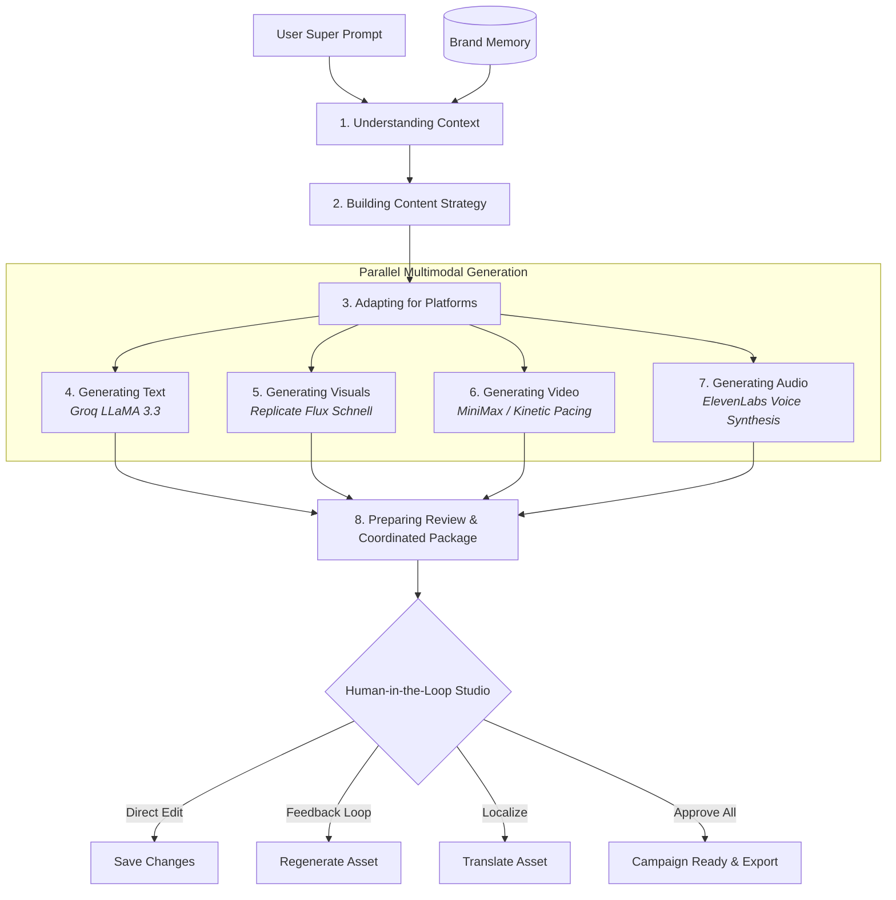

<div align="center">

# ⚡ VEYRA AI

### *From Context to Creation*

**Context-Aware Multilingual Multimodal AI Content Creation & Refinement Platform**

[](https://fastapi.tiangolo.com)
[](https://www.python.org/)
[](https://groq.com)
[](https://replicate.com)
[](#-multilingual--cultural-transcreation)
[](LICENSE)

<br/>

> **Core Philosophy:**  
> **`ONE CONTEXT ➔ MULTIPLE MEDIA ➔ ONE COORDINATED CAMPAIGN`**

</div>

---

## 📖 Table of Contents

- [Overview](#-overview)
- [The Problem vs. The Veyra Solution](#-the-problem-vs-the-veyra-solution)
- [Key Features](#-key-features)
- [8-Stage AI Orchestration Pipeline](#-8-stage-ai-orchestration-pipeline)
- [System Architecture](#-system-architecture)
- [Multimodal Model Stack](#-multimodal-model-stack)
- [Multilingual & Cultural Transcreation](#-multilingual--cultural-transcreation)
- [Project Structure](#-project-structure)
- [Getting Started](#-getting-started)
  - [Prerequisites](#prerequisites)
  - [Installation](#installation)
  - [Environment Configuration](#environment-configuration)
  - [Running the Application](#running-the-application)
- [Configuration Reference](#-configuration-reference)
- [API Documentation](#-api-documentation)
- [UI & Workspace Tour](#-ui--workspace-tour)
- [Demo Mode vs. Live AI Mode](#-demo-mode-vs-live-ai-mode)
- [Contributing](#-contributing)
- [License](#-license)

---

## 🌟 Overview

**Veyra AI** is a next-generation generative platform designed to eliminate the fragmentation inherent in current AI marketing workflows. Instead of prompting disparate single-purpose tools (generating copy in one app, posters in another, video prompts in a third, and audio elsewhere), Veyra operates on a unified creative intelligence model.

From a single high-level user prompt (or guided inputs), Veyra:
1. **Extracts multi-dimensional context** (audience, core intent, tone, cultural background, platform requirements, brand voice).
2. **Formulates an end-to-end content strategy** with synchronized milestone messaging.
3. **Orchestrates coordinated multimodal assets** simultaneously across text, visual posters, vertical video reels, and audio voice-overs.
4. **Empowers human-in-the-loop review** through in-place copy editing, targeted prompt regeneration, and native cultural localization.

---

## 🥊 The Problem vs. The Veyra Solution

| Traditional AI Content Generation | The Veyra AI Unified Paradigm |
| :--- | :--- |
| **Siloed Tools**: Text from LLMs, images from image tools, video prompts from third parties. | **Unified Context Engine**: One prompt drives synchronized copy, graphics, video, and audio. |
| **Inconsistent Voice**: Tone and messaging clash across different platforms and modalities. | **Guaranteed Cohesion**: Every generated asset adheres to the same strategic goals and Brand Memory. |
| **Literal Translations**: Machine translations that sound robotic and miss cultural resonance. | **Authentic Transcreation**: Regionally rooted phrasing, vernacular idioms, and local voice personas. |
| **Disconnected Assets**: Separate hooks and calls-to-action that fail to reinforce each other. | **Cross-Platform Synergy**: Instagram visual hooks, LinkedIn thought leadership, and Shorts video reels align seamlessly. |
| **All-or-Nothing Generation**: Inability to tweak single elements without starting over. | **Granular Human-in-the-Loop Refinement**: Edit text, regenerate specific assets with guidance, or translate individual items on demand. |

---

## ✨ Key Features

### 🧠 1. Intelligent Context Engine
- Translates vague or concise natural language prompts into structured creative intelligence schemas.
- Analyzes campaign subject, primary conversion objective, target demographic, channel mix, emotional tone, and market region.
- Live **Context Inspector** dock allows manual inspection and dynamic parameter tuning.

### ⚡ 2. 8-Stage Real-Time Orchestration Pipeline
- Transparent, asynchronous generation workflow with live progress tracking across all eight phases.
- Real-time status reporting via polling APIs, showing active steps, completion percentages, and milestone updates.

### 🎨 3. Multimodal Multi-Platform Synthesis
- **Copy & Captions**: Optimized hooks, structured body text, character count tracking, and hashtag strategy tailored per platform (Instagram, LinkedIn, YouTube Shorts).
- **Visual Posters**: High-fidelity promotional artwork rendered with aspect ratio selection (4:5, 1:1) and crisp multilingual typographic overlays.
- **Kinetic Video Storyboards**: 9:16 vertical video pacing with shot-by-shot scene descriptions and synchronized bilingual subtitles.
- **Regional Voice-Over Audio**: Scripted voice narrations with regional accents and waveform telemetry visualization.

### 🌐 4. Multilingual Cultural Transcreation
- Native support for **English**, **Tamil (தமிழ்)**, and **Hindi (हिंदी)**, with expandable support for Telugu, Malayalam, Kannada, and Bengali.
- Moves beyond mechanical word replacement to deliver culturally resonant idioms, regional colloquialisms, and demographic-specific appeals.
- Complete UI internationalization (i18n) with instant in-browser language switching.

### 💎 5. Persistent Brand Memory Engine
- Centralized storage for brand identity: Brand Name, Core Narrative Premise, Primary Brand Color token, Voice & Tone Attributes, and Creative Guardrails.
- Injects brand rules into every generation stage, ensuring consistent styling and communication.

### 🛠️ 6. Human-in-the-Loop Refinement Studio
- **Direct In-Place Editing**: Modify opening hooks, body copy, and CTAs directly in modal editors.
- **Guided AI Regeneration**: Provide natural feedback (e.g., *"Make the hook punchier and emphasize the prize pool"*) to re-run specific asset models.
- **One-Click Translation**: Culturally translate any individual asset to a target language instantly.
- **One-Click Batch Approval**: Mark all assets as approved to transition the campaign to `CAMPAIGN_READY` status for export.

### 📦 7. Hybrid Execution (Instant Demo Mode & Live AI)
- **Zero-Token Demo Mode**: Comes pre-configured with high-fidelity realistic simulations and bundled assets. Test the complete UI, pipeline, and editing flows offline without incurring API costs.
- **Live AI Mode**: Plug in Groq and Replicate API keys to generate content with state-of-the-art production models.

---

## 🔄 8-Stage AI Orchestration Pipeline



---

## 🏗️ System Architecture

```
┌────────────────────────────────────────────────────────────────────────┐
│                          BROWSER CLIENT (SPA)                          │
│   • Dark/Light Obsidian UI       • 8-Stage Orchestration Stepper      │
│   • Interactive Context Inspector • Multimodal Asset Review Cards      │
│   • Multi-Locale i18n Engine      • Modals (Edit, Regenerate, Trans)   │
└───────────────────────────────────┬────────────────────────────────────┘
                                    │ HTTP / REST APIs
                                    ▼
┌────────────────────────────────────────────────────────────────────────┐
│                        FASTAPI BACKEND SERVICE                         │
│  ┌─────────────────────────┐            ┌───────────────────────────┐  │
│  │       API Routers       │            │      Core Services        │  │
│  │ • /api/generate         │            │ • ContextEngine           │  │
│  │ • /api/campaigns        │◄──────────►│ • AIOrchestrator          │  │
│  │ • /api/assets           │            │ • ModelRouter             │  │
│  │ • /api/brand            │            │ • Text / Translation Svc  │  │
│  │ • /api/history          │            │ • Image / Video / Audio   │  │
│  │ • /api/system           │            └─────────────┬─────────────┘  │
│  └─────────────────────────┘                          │                │
│                                                       │ Model Routing  │
│                                                       ▼                │
│  ┌──────────────────────────────────────────────────────────────────┐  │
│  │                    FOUNDATIONAL MODEL PROVIDERS                  │  │
│  │   • Groq Cloud API (LLaMA 3.3 70B Versatile — Text & Reasoning)   │  │
│  │   • Replicate (Flux Schnell — Visual Generation)                 │  │
│  │   • Video & Audio Synthesis (MiniMax Video, ElevenLabs Audio)    │  │
│  │   • High-Fidelity Local Simulation Fallback (Demo Mode)          │  │
│  └──────────────────────────────────────────────────────────────────┘  │
└────────────────────────────────────────────────────────────────────────┘
```

---

## 🤖 Multimodal Model Stack

| Modality / Task | Model / Provider | Primary Purpose |
| :--- | :--- | :--- |
| **Context Extraction** | `groq/llama-3.3-70b-versatile` | Ultra-fast structured JSON extraction and persona analysis |
| **Platform Copywriting** | `groq/llama-3.3-70b-versatile` | Platform-specific copy, hooks, CTAs, and hashtags |
| **Cultural Transcreation** | `groq/llama-3.3-70b-versatile` | Culturally authentic vernacular translation |
| **Visual Media** | `black-forest-labs/flux-schnell` | High-fidelity marketing posters with localized overlays |
| **Kinetic Video** | `minimax/video-01` | Vertical 9:16 reels, frame sequence storyboards, subtitles |
| **Voice Synthesis** | `elevenlabs/speech-synthesis` | Regional character accents, timing, and waveform telemetry |
| **Fallback Engine** | Built-in High-Fidelity Engine | Zero-latency, token-free simulation for testing & demos |

---

## 🌐 Multilingual & Cultural Transcreation

Veyra treats language not as a simple translation task, but as an integral part of creative storytelling:

```
Source Intent (College Tech Hackathon)
  ├── English   ➔ "Build the Intelligent Future — ₹1.5L Prize Pool"
  ├── Tamil     ➔ "உங்கள் திறமைக்கு ஒரு மாபெரும் சவால் — ₹1,50,000 ரொக்கப் பரிசுகள்!"
  └── Hindi     ➔ "तकनीक के सबसे बड़े संग्राम के लिए तैयार हो जाइए — ₹1,50,000 नकद पुरस्कार!"
```

- **Colloquial Appropriateness**: Uses energetic, youthful phrasing for college campaigns while maintaining professional credibility for enterprise audiences.
- **Synchronized Subtitles**: Video assets generate synchronized dual-language subtitles (Regional Vernacular + English) ready for short-form video algorithms.
- **Voiceover Personas**: Audio assets include region-specific voice personas (e.g., *Karthik - Dynamic Youth Accent (Chennai)*, *Aarav - Energetic Tech Presenter (Delhi)*, *Marcus - Resonant Tech Narrator*).

---

## 📁 Project Structure

```
Veyra AI/
├── assets/                          # Static demo media & generated image files
│   ├── hackathon_poster.jpg
│   ├── stitch_poster.jpg
│   ├── stitch_video.jpg
│   ├── stitch_workspace.jpg
│   └── video_thumbnail.jpg
├── backend/                         # FastAPI Application Core
│   ├── __init__.py
│   ├── config.py                    # Pydantic BaseSettings & environment variables
│   ├── main.py                      # FastAPI app entry point & route mounting
│   ├── api/                         # REST API endpoint modules
│   │   ├── assets.py                # Asset editing, regeneration, translation, review
│   │   ├── brand.py                 # Brand Memory retrieval & updates
│   │   ├── campaigns.py             # Campaign creation, retrieval, approvals
│   │   ├── generation.py            # Asynchronous generation runner & polling
│   │   ├── history.py               # Historical campaign timeline
│   │   └── settings_api.py          # System config, provider state & model updates
│   ├── models/                      # Pydantic data schemas
│   │   ├── asset.py                 # Asset, AssetType, AssetStatus schemas
│   │   ├── brand.py                 # BrandMemory schema
│   │   ├── campaign.py              # Campaign, GenerationRequest, StrategyPlan
│   │   └── context.py               # CampaignContext schema
│   ├── services/                    # Business logic & AI abstractions
│   │   ├── audio_service.py         # Voice-over synthesis & waveform generator
│   │   ├── context_engine.py        # Natural language context extraction
│   │   ├── image_service.py         # Image generation & typography overlay
│   │   ├── model_router.py          # Central provider router
│   │   ├── orchestrator.py          # 8-stage asynchronous orchestration engine
│   │   ├── text_service.py          # Multi-platform copywriting
│   │   ├── translation_service.py   # Cultural transcreation service
│   │   └── video_service.py         # Video storyboard & subtitle synthesis
│   └── utils/
│       └── demo_data.py             # Pre-configured campaign seed data
├── frontend/                        # Clean Single Page Application (SPA)
│   ├── index.html                   # Workspace UI markup
│   ├── css/                         # Modular CSS design system
│   │   ├── variables.css            # Color tokens, typography, glassmorphism
│   │   ├── base.css                 # Reset & base element styling
│   │   ├── layout.css               # Nav rail, app main, inspector layout
│   │   ├── components.css           # Buttons, badges, forms, modals, tabs
│   │   ├── workspace.css            # Stepper, strategy plan, prompt dock
│   │   ├── assets.css               # Multimodal asset cards & waveform player
│   │   └── responsive.css           # Mobile & tablet media queries
│   ├── js/                          # Vanilla JavaScript modules
│   │   ├── api.js                   # Unified REST client with error handling
│   │   ├── app.js                   # App bootstrapping, routing & global events
│   │   ├── campaign.js              # Campaign management & history timeline
│   │   ├── generation.js            # Generation trigger & stepper poller
│   │   ├── localization.js          # Dynamic i18n client translator
│   │   ├── review.js                # Modals (Edit, Regenerate, Translate)
│   │   ├── theme.js                 # Dark / Light theme manager
│   │   └── workspace.js             # Asset grid rendering & filter state
│   └── locales/                     # UI localization dictionaries
│       ├── en.json                  # English
│       ├── hi.json                  # Hindi (हिंदी)
│       └── ta.json                  # Tamil (தமிழ்)
├── .env.example                     # Environment template
├── requirements.txt                 # Python dependencies
└── README.md                        # Documentation
```

---

## 🚀 Getting Started

### Prerequisites

- **Python 3.10+** installed on your system.
- Modern Web Browser (Chrome, Firefox, Edge, Safari).
- *(Optional)* Free [Groq API Key](https://console.groq.com) for real-time text reasoning.
- *(Optional)* [Replicate API Token](https://replicate.com) for multimodal media synthesis.

### Installation

1. **Clone the repository:**
   ```bash
   git clone https://github.com/vasikaran46/Veyra-AI.git
   cd "Veyra AI"
   ```

2. **Create and activate a virtual environment:**
   ```bash
   # On macOS / Linux:
   python3 -m venv venv
   source venv/bin/activate

   # On Windows (PowerShell):
   python -m venv venv
   .\venv\Scripts\Activate.ps1
   ```

3. **Install dependencies:**
   ```bash
   pip install -r requirements.txt
   ```

### Environment Configuration

Copy the example environment configuration:
```bash
# On Linux / macOS:
cp .env.example .env

# On Windows (PowerShell):
Copy-Item .env.example .env
```

Edit `.env` to supply your API credentials:
```ini
# ===================================================
# VEYRA AI — Environment Configuration
# ===================================================

# Groq API Configuration (Fast text reasoning & translation)
GROQ_API_KEY=your_groq_api_key_here
TEXT_MODEL=llama-3.3-70b-versatile

# Replicate API Configuration (Multimodal media generation)
REPLICATE_API_TOKEN=your_replicate_api_token_here
IMAGE_MODEL=black-forest-labs/flux-schnell
VIDEO_MODEL=minimax/video-01
AUDIO_MODEL=elevenlabs/speech-synthesis

# Server Configuration
PORT=8000
HOST=127.0.0.1
DEBUG=true

# Demo Mode (Set to false when using live API keys)
DEMO_MODE=false
```

> 💡 **Tip:** If `DEMO_MODE=true` (or if API keys are left empty), Veyra AI runs in **Demo Mode**. You can launch and test all features immediately without any API keys!

### Running the Application

Start the FastAPI application with Uvicorn:
```bash
python -m uvicorn backend.main:app --reload --host 127.0.0.1 --port 8000
```

Once running:
- **Interactive Web App**: Open [http://127.0.0.1:8000](http://127.0.0.1:8000)
- **Interactive API Swagger Docs**: Open [http://127.0.0.1:8000/docs](http://127.0.0.1:8000/docs)
- **OpenAPI JSON Spec**: Open [http://127.0.0.1:8000/openapi.json](http://127.0.0.1:8000/openapi.json)

---

## ⚙️ Configuration Reference

| Environment Variable | Default Value | Description |
| :--- | :--- | :--- |
| `GROQ_API_KEY` | *None* | API Key for Groq Cloud inference |
| `TEXT_MODEL` | `llama-3.3-70b-versatile` | LLaMA model used for context extraction, strategy, and copy |
| `REPLICATE_API_TOKEN` | *None* | API token for Replicate multimodal models |
| `IMAGE_MODEL` | `black-forest-labs/flux-schnell` | Image generation diffusion model |
| `VIDEO_MODEL` | `minimax/video-01` | Video generation model |
| `AUDIO_MODEL` | `elevenlabs/speech-synthesis` | Audio voice synthesis model |
| `SUPABASE_URL` | *None* | *(Optional)* Supabase URL for persistent database storage |
| `SUPABASE_KEY` | *None* | *(Optional)* Supabase Key |
| `HOST` | `127.0.0.1` | Host address to bind the Uvicorn server |
| `PORT` | `8000` | Port number to bind the server |
| `DEBUG` | `true` | Enables hot-reload and verbose logging |
| `DEMO_MODE` | `true` | When true, uses high-fidelity simulation without calling external APIs |

---

## 📡 API Documentation

### 1. Generation Endpoints (`/api/generate`)
- `POST /api/generate`: Submits a new prompt and optional overrides. Returns a `job_id` and kicks off the 8-stage pipeline in the background.
- `GET /api/generate/{job_id}`: Polls the real-time status, current active step, progress percentage, and campaign payload.

### 2. Campaign Endpoints (`/api/campaigns`)
- `GET /api/campaigns`: Lists all campaigns sorted by reverse chronology.
- `GET /api/campaigns/{campaign_id}`: Retrieves full details of a specific campaign (including context, strategy plan, and assets).
- `POST /api/campaigns`: Manually initializes a campaign with custom context parameters.
- `POST /api/campaigns/{campaign_id}/approve-all`: Approves all assets and sets status to `CAMPAIGN_READY`.

### 3. Asset Endpoints (`/api/assets`)
- `GET /api/assets`: Queries assets across all campaigns with filters (`platform`, `asset_type`, `status`, `language`, `search`).
- `GET /api/assets/{asset_id}`: Fetches asset details.
- `PATCH /api/assets/{asset_id}`: In-place edit of copy, hooks, CTAs, aspect ratio, or prompts.
- `POST /api/assets/{asset_id}/approve`: Marks an individual asset as `APPROVED`.
- `POST /api/assets/{asset_id}/regenerate`: Triggers model-specific regeneration with custom feedback instructions.
- `POST /api/assets/{asset_id}/translate`: Transcreates the asset into a specified target language.

### 4. Brand Memory (`/api/brand`)
- `GET /api/brand`: Returns current active brand memory configuration.
- `PATCH /api/brand`: Updates brand name, narrative premise, color token, voice attributes, and guidelines.

### 5. History & System (`/api/history`, `/api/system`)
- `GET /api/history`: Timeline summary of all generation jobs.
- `GET /api/system/config`: Reports provider availability (Groq, Replicate, Supabase), active models, and demo mode state.
- `POST /api/system/config`: Updates system settings (e.g., toggling Demo Mode at runtime).

---

## 🖥️ UI & Workspace Tour

```
┌───────────────────────────────────────────────────────────────────────────────────────────────────┐
│ ⚡ VEYRA AI  │  ✨ HACK//NEXUS 2025 Launch Campaign  [Ready for Review]   [New Campaign] [Approve] │
├──────────────┼────────────────────────────────────────────────────────────────────────────────────┤
│ • Workspace  │  💡 Context Intelligence Banner                                                   │
│ • Campaigns  │  --------------------------------------------------------------------------------  │
│ • Library    │  🧠 8-Stage Real-time AI Orchestration Pipeline [100% Completed]                   │
│ • History    │  [✓ Context] [✓ Strategy] [✓ Platform] [✓ Text] [✓ Image] [✓ Video] [✓ Audio] [✓]  │
│ • Brand      │  --------------------------------------------------------------------------------  │
│ • Settings   │  📊 Content Strategy Plan & Cross-Platform Synergy Matrix                          │
│              │  --------------------------------------------------------------------------------  │
│ [🌙 Theme]   │  🗂️ Multimodal Asset Grid                                                          │
│ [🌐 Lang]    │  [All Assets] [Instagram] [LinkedIn] [YouTube Shorts]                              │
│              │  │ IG Copy (Ta)  │ │ LinkedIn Copy │ │ Visual Poster │ │ Kinetic Video │          │
│              │  │ [Edit][Regen] │ │ [Edit][Regen] │ │ [View][Regen] │ │ [Play][Regen] │          │
│              │  └───────────────┘ └───────────────┘ └───────────────┘ └───────────────┘          │
│              │  --------------------------------------------------------------------------------  │
│              │  💬 Super Prompt Dock: [ Tell Veyra what you want to create... ] [ ✨ Generate ]   │
└──────────────┴────────────────────────────────────────────────────────────────────────────────────┘
```

1. **Left Navigation Rail**: Quick access to Workspace, Campaigns, Content Library, History, Brand Memory, and Settings, plus the Theme Switcher (Dark/Light) and Language Switcher (EN / TA / HI).
2. **Context Banner**: Live breakdown of the subject, primary objective, target audience, and active brand profile.
3. **8-Stage Orchestration Stepper**: Animated status progression showing the active phase during generation.
4. **Content Strategy Card**: High-level cross-platform narrative, channel roles, and phased campaign milestones.
5. **Asset Canvas**: Multimodal cards with live playback, character counters, status badges, and action buttons (`Edit`, `Regenerate`, `Translate`, `Approve`).
6. **Context Inspector (Right Dock)**: Real-time inspection and adjustment of core campaign metadata.
7. **Bottom Super Prompt Dock**: Instant prompt input with pre-configured quick suggestion pills.

---

## 🧪 Demo Mode vs. Live AI Mode

| Feature | Demo Mode (`DEMO_MODE=true`) | Live AI Mode (`DEMO_MODE=false`) |
| :--- | :--- | :--- |
| **API Keys Needed** | None | Groq & Replicate API tokens |
| **Cost** | 100% Free | Standard API usage costs |
| **Speed** | Instantaneous simulated pipeline | Real-time model execution |
| **Multimodal Assets** | Pre-bundled high-fidelity campaign assets | Freshly generated custom assets |
| **Interactivity** | Full editing, regeneration simulation, i18n | Full generation and refinement |
| **Ideal For** | Hackathons, demos, offline workshops, testing | Production content creation |

---

## 🤝 Contributing

Contributions to Veyra AI are welcome! Follow these steps:

1. **Fork the repository** on GitHub.
2. **Create a feature branch**:
   ```bash
   git checkout -b feature/amazing-feature
   ```
3. **Commit your changes**:
   ```bash
   git commit -m "Add amazing feature"
   ```
4. **Push to the branch**:
   ```bash
   git push origin feature/amazing-feature
   ```
5. **Open a Pull Request** describing your additions or fixes.

---

## 📄 License

This project is licensed under the **MIT License**. See the [LICENSE](LICENSE) file for full details.

---

<div align="center">

**Built with passion for next-generation content creators.**  
*Veyra AI — Empowering unified, culturally resonant multimodal storytelling.*

</div>
